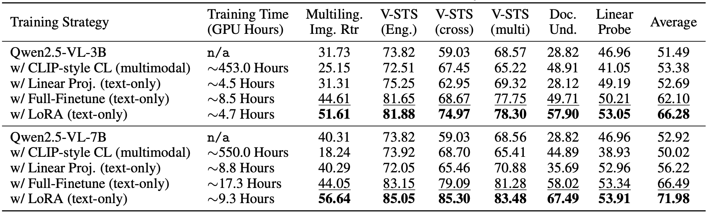
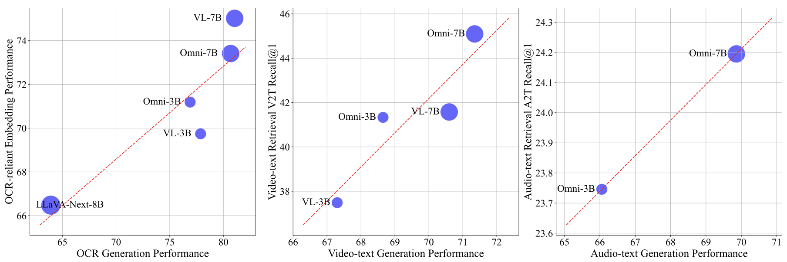

<div align="center">

<h1>Scaling Language-centric Omnimodal Representation Learning</h1>

<div>
    <a target='_blank'>Chenghao Xiao,</a>&emsp;
    <a target='_blank'>Hou Pong Chan<sup>†</sup>,</a>&emsp;
    <a target='_blank'>Hao Zhang<sup>†</sup>,</a>&emsp;
    <a target='_blank'>Weiwen Xu,</a>&emsp;
    <a target='_blank'>Mahani Aljunied,</a>&emsp;
    <a target='_blank'>Yu Rong<sup>‡</sup></a>&emsp;
</div>

<div>
    <em>DAMO Academy, Alibaba Group</em>&emsp;
</div>
<em><sup>†</sup>Corresponding Authors &emsp;<sup>‡</sup>Project Head</em>

<h5 align="center">

[](https://arxiv.org/abs/2510.11693)
[](https://huggingface.co/papers/2510.11693)
[](https://huggingface.co/LCO-Embedding)
<br>
</h5> 


</div>

<h5 align="center"> 🌟 This repo contains the codes and datasets for the paper "Scaling Language-centric Omnimodal Representation Learning" to appear at NeurIPS 2025. If our project helps you, please give us a star ⭐ on GitHub and upvote our HF paper to support us. </h2>


<h2>🎉 Updates</h2>

- **[2025-10]** Check out our [paper](https://huggingface.co/papers/2510.11693) on Huggingface Daily Papers.
- **[2025-09]** Our paper is accepted by NeurIPS 2025.

<h2>Quick Start</h2>

```python
from transformers import Qwen2_5OmniThinkerForConditionalGeneration, Qwen2_5OmniProcessor
from qwen_omni_utils import process_mm_info

processor = Qwen2_5OmniProcessor.from_pretrained("LCO-Embedding/LCO-Embedding-Omni-7B") # or add a `max_pixels = 1280*28*28' for efficient encoding
model = Qwen2_5OmniThinkerForConditionalGeneration.from_pretrained("LCO-Embedding/LCO-Embedding-Omni-7B",
                                                                    torch_dtype=torch.bfloat16,
                                                                    device_map="auto")
```

<h3>Text Batch Encodings:</h3>
    
```python
texts = ["some random text", "a second random text", "a third random text"] * 30
batch_size = 8
text_prompt =  "{}\nSummarize the above text in one word:" 

all_text_embeddings = []

with torch.no_grad():
    for i in tqdm(range(0, len(texts), batch_size)):
        batch_texts = texts[i : i + batch_size]
        batch_texts = [text_prompt.format(text) for text in batch_texts]
        messages = [[
            {
                "role": "user",
                "content": [
                    {"type": "text", "text":text},
                ],

            }
        ] for text in batch_texts]
        text_inputs = processor.apply_chat_template(messages, tokenize = False, add_generation_prompt = True)
        text_inputs = processor(
        text = text_inputs,
        padding = True,
        return_tensors = "pt",
        )
        text_inputs = text_inputs.to("cuda")
        text_outputs = model(
            **text_inputs, output_hidden_states=True, return_dict=True
        ).hidden_states[-1][:, -1, :]
        all_text_embeddings.append(text_outputs.to(torch.float16).cpu())

all_text_embeddings = torch.cat(all_text_embeddings, dim=0)
```

<h3>Image Batch Encodings:</h3>

```python

images = [some random PIL.Image] * 100 # will be good to load them using dataloader; see MIEB evaluation pipeline
image_prompt = "\nSummarize the above image in one word:"
batch_size = 8

all_image_embeddings = []

with torch.no_grad():
    for i in tqdm(range(0, len(images), batch_size)):
        batch_images = images[i : i + batch_size]
        messages = [[
            {
                "role": "user",
                "content": [
                    {"type": "image", "image":image},
                    {"type": "text", "text": image_prompt},
                ],

            }
        ] for image in batch_images]
        text = processor.apply_chat_template(
            messages, tokenize=False, add_generation_prompt=True
        )
        audio_inputs, image_inputs, video_inputs = process_mm_info(messages, use_audio_in_video=True)
        inputs = processor(
            text=text, 
            audio=audio_inputs, 
            images=image_inputs, 
            videos=video_inputs, 
            return_tensors="pt", 
            padding=True
        )
        inputs = inputs.to("cuda")
        image_outputs = model(
            **inputs, output_hidden_states=True, return_dict=True
        ).hidden_states[-1][:, -1, :]
        all_image_embeddings.append(image_outputs.to(torch.float16).cpu())

all_image_embeddings = torch.cat(all_image_embeddings, dim=0)
```

<h2>Training</h2>

See our [training](https://github.com/LCO-Embedding/LCO-Embedding/tree/main/Training) folder! We will continue to update resources and guidelines for cooking the best MLLM-based omnimodal representation models which we hope will contribute to the community!

<h2>Evaluation</h2>

We are cleaning our unified embedding evaluation framework which will be pushed shortly.

<h2>Analysis</h2>

We will provide embedding space analysis code which will be pushed shortly.

<h2> Overview</h2>

- We introduce **LCO-Embedding**, a language-centric omnimodal representation learning method and the LCO-Embedding model families, setting a new state-of-the-art on [MIEB](https://huggingface.co/blog/isaacchung/introducing-mieb) (Massive Image Embedding Benchmark), while supporting audio and videos.
- We introduce the **Generation-Representation Scaling Law**, and connect models' generative capabilities and their representation upper bound.
- We introduce **SeaDoc**, a challenging visual document retrieval task in Southeast Asian languages, and show that continual generative pretraining before contrastive learning raises the representation upper bound.

<div align='center'></div>


<h2>📊 Evaluation Results</h2>

We evaluate LCO-Embedding with the state-of-the-art embedding models, including E5-V, Voyage Multimodal 3, mmE5, and GME, on a MIEB-Lite benchmark (51 tasks) broken down by task categories.  

<div align='center'></div>

Performance and efficiency comparisons of different training strategies using 3B and 7B variants of Qwen2.5-VL backbones.

<div align='center'></div>

Scaling relationship between generation benchmark performance (X-axis) and representation benchmark performance after language-centric contrastive learning (Y-axis).

<div align='center'></div>


<h2>🔧 Getting Started</h2>

Ongoing: We are updating all code and resources.


<h2>📑 Citation</h2>

If you find LCO-Embedding useful for your research and applications, please cite using this BibTeX:

```bibtex
@misc{xiao2025scaling,
    title={Scaling Language-Centric Omnimodal Representation Learning}, 
    author={Chenghao Xiao and Hou Pong Chan and Hao Zhang and Weiwen Xu and Mahani Aljunied and Yu Rong},
    year={2025},
    eprint={2510.11693},
    archivePrefix={arXiv},
    primaryClass={cs.CL},
    url={https://arxiv.org/abs/2510.11693}, 
}
```
